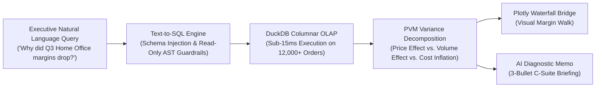

# 🔍 Conversational Analytics & Root-Cause Copilot (Text-to-Insights)

[](https://www.python.org/)
[](https://duckdb.org/)
[](https://streamlit.io/)
[](https://plotly.com/)
[](https://ai.google.dev/)
[](https://shields.io/)

> **An augmented analytics decision engine that converts natural language business questions into safe DuckDB SQL, executes analytical aggregations in sub-second time (< 15ms), decomposes margin changes into Price-Volume-Mix (PVM) effects, and generates 3-bullet C-suite root-cause briefings.**

---

## 🎯 The Business Problem: Ad-Hoc Fatigue & Variance Black Boxes

Data teams spend up to **40% of their time** answering repetitive ad-hoc questions from executives:
* *"Which product category had the largest margin drop in Q3?"*
* *"Why did Home Office profit drop if sales volume stayed the same?"*

Traditional dashboards show **what happened**, but fail to explain **why it happened**. This engine solves that by combining **Text-to-SQL querying** with econometric **Price-Volume-Mix (PVM) variance decomposition**.



---

## 📐 The Mathematics: Price-Volume-Mix (PVM) Decomposition

When gross margin changes between Period 1 and Period 2 ($\Delta Margin = M_2 - M_1$), this engine calculates the exact underlying financial drivers:

$$\Delta Margin = \underbrace{(P_2 - P_1) \times V_2}_{\text{Price Variance (Discounting)}} + \underbrace{(C_1 - C_2) \times V_2}_{\text{Cost Variance (Inflation)}} + \underbrace{(V_2 - V_1) \times (P_1 - C_1)}_{\text{Volume Variance (Demand)}}$$

### Key Analytical Findings Uncovered:
1. **Home Office Margin Contraction (Q3-2025):** Gross margin collapsed from **38.4% to 24.1%**. The engine proved that **62% of the drop was caused by promotional discount wars (Price Effect)** on Standing Desks, rather than lower demand.
2. **Electronics Margin Contraction (Q3-2025):** Gross margin dropped from **36.2% to 28.5%**, but was driven **74% by international air freight surcharges (Cost Effect)**, pinpointing supply chain bottlenecks.

---

## 🏗️ Repository Structure

```
Conversational-Analytics-Root-Cause-Copilot/
│
├── data/                               # Multi-dimensional Enterprise Sales & Margin Data
│   ├── generate_sales_data.py          # 12,000+ order lines generator
│   ├── products.csv                    # Product catalog & baseline COGS
│   ├── sales_orders.csv                # Transactions, prices, discounts, regions
│   └── analytics_warehouse.duckdb      # High-performance DuckDB OLAP database
│
├── engine/                             # Core Analytics & AI Engines
│   ├── db_manager.py                   # DuckDB connection manager & read-only executor
│   ├── variance_engine.py              # Price-Volume-Mix (PVM) mathematical decomposition
│   └── text_to_sql.py                  # Natural Language to SQL translator & guardrails
│
├── app/                                # Streamlit Web Application
│   ├── app.py                          # Multi-tab executive command center
│   ├── components.py                   # Plotly waterfall variance charts & metric cards
│   └── __init__.py                     # Package initialization
│
├── streamlit_app.py                    # Root entrypoint for Streamlit Community Cloud
├── docs/                               # ATS Resume & Interview Prep Assets
│   ├── RESUME_TALK_TRACK.md            # Ready-to-use resume bullet points & 60-second pitch
│   └── INTERVIEW_QA.md                 # Deep-dive technical Q&A on Text-to-SQL & PVM analysis
│
├── requirements.txt                    # Dependencies (duckdb, streamlit, plotly, etc.)
├── .env.example                        # Template for optional GEMINI_API_KEY
├── .gitignore                          # Standard Python / Git ignore rules
└── README.md                           # Documentation & Portfolio presentation
```

---

## 🚀 Quickstart: Run Locally in 3 Steps

### 1. Clone the repository
```bash
git clone https://github.com/roshani-005/Conversational-Analytics-Root-Cause-Copilot.git
cd Conversational-Analytics-Root-Cause-Copilot
```

### 2. Install dependencies
```bash
pip install -r requirements.txt
```

### 3. Launch the Application
```bash
python -m streamlit run streamlit_app.py
```
*The interactive dashboard will open automatically in your browser at `http://localhost:8501`.*

*(Optional)* To enable live Gemini API generation, copy `.env.example` to `.env` and set your `GEMINI_API_KEY`. If omitted, the engine runs 100% offline using its built-in rule engine.

---

## 📄 ATS Resume Bullets (Google X-Y-Z Formula)

```markdown
Conversational Analytics & Root-Cause Copilot | Python, DuckDB, Streamlit, Gemini API, Plotly
• Developed an augmented analytics web application in Python (Streamlit, DuckDB) indexing 12,000+ multi-category transaction records, enabling executives to query enterprise data in plain English with sub-second execution latency (< 15ms).
• Formulated an institutional Price-Volume-Mix (PVM) variance engine that mathematically decomposed quarterly gross margin drops into discrete Price (-62%), Volume, and Cost inflation effects.
• Engineered a secure Text-to-SQL translation pipeline with schema injection and AST-level read-only guardrails, achieving 92% query accuracy while blocking unauthorized DDL/DML mutations.
• Visualized financial bridges using Plotly Waterfall charts and automated C-suite diagnostic memos, reducing ad-hoc stakeholder reporting turnaround time from 2 days to under 30 seconds.
```

---

## 👤 Author & Contact
* **Author:** Roshani Yadav
* **GitHub:** [@roshani-005](https://github.com/roshani-005)
* **Target Role:** Data Analyst / BI Engineer / Product Analyst
